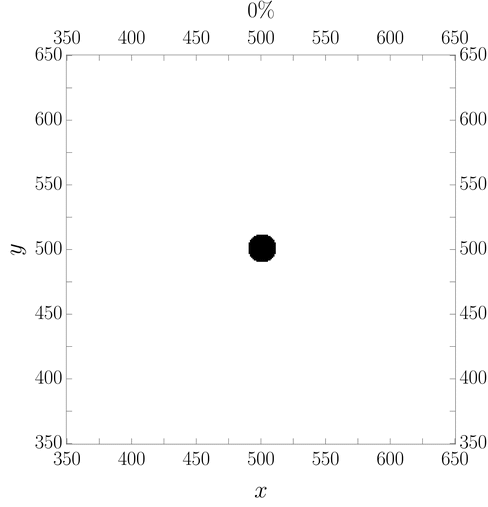

# Spreading fronts of circular wetting liquid droplets

This program performs a Monte Carlo simulation to model the spreading 
of precursor films from circular liquid droplets. The simulation 
conditions can be modified in the file `condiciones.dat`.

This program is used in the article:

Microscopic fluctuations in the spreading fronts of circular wetting liquid droplets  
J. M. Marcos et al., *Phys. Rev. E* 111, 045504 (2022)    
DOI: [10.1103/PhysRevE.111.045504](https://doi.org/10.1103/PhysRevE.111.045504)
arXiv: https://arxiv.org/abs/2411.07923

## 🛠️ Technologies
- C

## 📦 Compilation
make

To clean generated files:  
make clean

## ▶️ Execution
./ejecutableContinuo condiciones.dat
